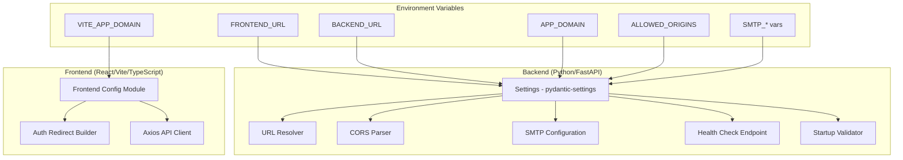

# Design Document: Domain-Independent Infrastructure

## Overview

This design establishes a domain-independent infrastructure layer for the AI Interview & Presentation Coach application. The core principle is that **all URL resolution, CORS configuration, authentication redirects, and email configuration are driven exclusively by environment variables**, making domain changes a configuration-only operation.

The system introduces three key modules:
1. **URL Resolver** — a pure function that computes base URLs from environment variable inputs, handling normalization, validation, and fallback logic.
2. **Auth Redirect Builder** — a pure function that constructs authentication callback URLs from domain configuration, with hostname validation and fallback.
3. **CORS Configuration Parser** — a function that parses comma-separated origin lists, validates entries, auto-includes FRONTEND_URL, and applies sensible defaults.

These modules are designed as pure functions with explicit parameters (no global state reads), making them trivially testable under any domain configuration without requiring network access or external services.

## Architecture



### Design Decisions

1. **Pure functions with parameter injection**: URL Resolver, Auth Redirect Builder, and CORS Parser all accept configuration as parameters rather than reading from `os.environ` or `import.meta.env` directly. This enables testing without mocking global state.

2. **Validation at startup, not per-request**: URL format validation, SMTP completeness checks, and missing variable warnings all execute once at application startup via the `lifespan` handler. This avoids repeated validation overhead and surfaces misconfigurations immediately.

3. **Graceful degradation over hard failures**: Missing optional variables (APP_DOMAIN, SMTP_*) log warnings but don't prevent the application from starting. Only invalid URL formats (FRONTEND_URL/BACKEND_URL not starting with `http://` or `https://`) cause a startup failure, since these would produce broken behavior.

4. **FRONTEND_URL auto-included in CORS**: The CORS parser always includes FRONTEND_URL in the allowed origins list (if set), ensuring the frontend can always reach the backend without requiring operators to duplicate the value in ALLOWED_ORIGINS.

## Components and Interfaces

### Backend Components

#### 1. `app/config.py` — Extended Settings

Extends the existing `pydantic-settings` `Settings` class with domain and SMTP configuration fields.

```python
class Settings(BaseSettings):
    # ... existing fields ...
    
    # Domain configuration
    app_domain: str = ""
    frontend_url: str = "http://localhost:5173"
    backend_url: str = "http://localhost:8000"
    
    # CORS
    allowed_origins: str = ""  # Changed to str for comma-separated parsing
    
    # SMTP configuration
    smtp_host: str = ""
    smtp_port: int = 587
    smtp_username: str = ""
    smtp_password: str = ""
    smtp_sender_email: str = ""
    smtp_sender_name: str = ""
```

#### 2. `app/url_resolver.py` — URL Resolution Module

Pure functions for URL normalization and validation.

```python
def resolve_url(url: str | None, fallback: str) -> str:
    """Resolve a URL from env var value, stripping trailing slashes.
    
    Args:
        url: The environment variable value (may be None or empty).
        fallback: Default URL to use when url is empty/None.
    
    Returns:
        Normalized URL without trailing slash.
    
    Raises:
        ValueError: If url is non-empty and doesn't start with http:// or https://
    """

def validate_url_format(url: str) -> bool:
    """Check if a URL starts with http:// or https://."""

def strip_trailing_slash(url: str) -> str:
    """Remove trailing slashes from a URL string."""
```

#### 3. `app/cors_parser.py` — CORS Configuration Parser

```python
def parse_allowed_origins(
    allowed_origins_str: str | None,
    frontend_url: str | None,
    default_origin: str = "http://localhost:5173",
) -> list[str]:
    """Parse comma-separated origins, validate, and auto-include frontend_url.
    
    Args:
        allowed_origins_str: Comma-separated origin string from env var.
        frontend_url: FRONTEND_URL value to auto-include.
        default_origin: Fallback when allowed_origins_str is empty.
    
    Returns:
        List of valid, deduplicated origin URLs.
    """
```

#### 4. `app/smtp_config.py` — SMTP Configuration Module

```python
@dataclass
class SmtpConfig:
    host: str
    port: int
    username: str
    password: str
    sender_email: str
    sender_name: str
    enabled: bool

def resolve_smtp_config(
    host: str | None,
    port: int | None,
    username: str | None,
    password: str | None,
    sender_email: str | None,
    sender_name: str | None,
) -> SmtpConfig:
    """Build SMTP configuration, disabling email if required vars are missing."""
```

#### 5. Health Check Endpoint (enhanced)

Returns domain configuration state:

```python
@v1_router.get("/health")
async def health_check():
    return {
        "status": "healthy",
        "version": settings.app_version,
        "app_domain": settings.app_domain or "",
        "frontend_url": resolved_frontend_url,
        "backend_url": resolved_backend_url,
        "domain_mode": determine_domain_mode(settings),
    }
```

Where `domain_mode` is one of: `"custom_domain"`, `"platform_url"`, or `"both"`.

#### 6. Startup Validator (in `lifespan`)

Runs at application startup to:
- Validate URL formats (fail on invalid)
- Log warnings for missing optional variables
- Log SMTP status
- Log domain mode summary

### Frontend Components

#### 1. `src/shared/lib/config.ts` — Frontend Configuration Module

```typescript
export function resolveAppDomain(
  viteAppDomain: string | undefined,
  windowOrigin: string
): string {
  // Returns https://{viteAppDomain} if valid, else windowOrigin
}

export function buildRedirectUrl(
  baseUrl: string,
  path: string
): string {
  // Concatenates base URL and path without double slashes
}

export function isValidHostname(hostname: string): boolean {
  // RFC-compliant hostname validation
}

export const APP_BASE_URL: string;  // Resolved at module load
export const API_BASE_URL: string;  // From VITE_API_URL or fallback
```

#### 2. `src/shared/lib/authRedirectBuilder.ts` — Auth Redirect Builder

```typescript
export function buildAuthRedirectUrl(
  domain: string | undefined,
  fallbackOrigin: string,
  path: string
): string {
  // Constructs redirect URL for auth flows
}

export function getEmailVerificationUrl(): string;
export function getPasswordResetUrl(): string;
```

## Data Models

### Backend Configuration Model

```python
class DomainConfig:
    """Resolved domain configuration after validation."""
    frontend_url: str       # Normalized, no trailing slash
    backend_url: str        # Normalized, no trailing slash
    app_domain: str         # Raw domain value (may be empty)
    domain_mode: str        # "custom_domain" | "platform_url" | "both"
    
class SmtpConfig:
    """Resolved SMTP configuration."""
    host: str
    port: int               # 1-65535
    username: str
    password: str
    sender_email: str       # Max 254 chars
    sender_name: str        # Max 78 chars
    enabled: bool           # False if required vars missing
```

### Health Check Response Model

```python
class HealthCheckResponse(BaseModel):
    status: str
    version: str
    app_domain: str
    frontend_url: str
    backend_url: str
    domain_mode: Literal["custom_domain", "platform_url", "both"]
```

### Environment Variable Summary

| Variable | Service | Required | Default | Description |
|----------|---------|----------|---------|-------------|
| `FRONTEND_URL` | Backend | No | `http://localhost:5173` | Frontend base URL |
| `BACKEND_URL` | Backend | No | `http://localhost:8000` | Backend base URL |
| `APP_DOMAIN` | Backend | No | `""` | Custom domain name |
| `ALLOWED_ORIGINS` | Backend | No | `http://localhost:5173` | Comma-separated CORS origins |
| `SMTP_HOST` | Backend | No* | `""` | SMTP server host |
| `SMTP_PORT` | Backend | No* | `587` | SMTP server port |
| `SMTP_USERNAME` | Backend | No | `""` | SMTP auth username |
| `SMTP_PASSWORD` | Backend | No | `""` | SMTP auth password |
| `SMTP_SENDER_EMAIL` | Backend | No* | `""` | Sender email address |
| `SMTP_SENDER_NAME` | Backend | No | `""` | Sender display name |
| `VITE_APP_DOMAIN` | Frontend | No | `window.location.origin` | Frontend domain for redirects |
| `VITE_API_URL` | Frontend | No | `http://localhost:8000/api/v1` | Backend API URL |

*Required for email features to be enabled.

## Correctness Properties

*A property is a characteristic or behavior that should hold true across all valid executions of a system — essentially, a formal statement about what the system should do. Properties serve as the bridge between human-readable specifications and machine-verifiable correctness guarantees.*

### Property 1: URL Trailing Slash Normalization

*For any* URL string (with or without trailing slashes), the URL Resolver SHALL produce an output that never ends with a `/` character, while preserving the rest of the URL unchanged.

**Validates: Requirements 1.1, 1.2**

### Property 2: URL Resolution Produces Correct Base URL

*For any* non-empty, valid URL (starting with `http://` or `https://`), the URL Resolver SHALL return that URL (normalized) as the base URL; and for any empty or None input, the URL Resolver SHALL return the specified fallback URL.

**Validates: Requirements 1.3, 9.3, 9.6**

### Property 3: Invalid URL Format Rejection

*For any* non-empty string that does not begin with `http://` or `https://`, the URL Resolver SHALL raise a validation error rather than returning a URL.

**Validates: Requirements 1.8**

### Property 4: CORS Origins Parsing and Trimming

*For any* comma-separated string of valid HTTP(S) URLs with arbitrary whitespace around entries, the CORS Parser SHALL produce a list containing exactly those URLs with whitespace trimmed, preserving the original URL values.

**Validates: Requirements 2.3, 6.1, 6.2**

### Property 5: FRONTEND_URL Auto-Inclusion in CORS

*For any* non-empty valid FRONTEND_URL value and any ALLOWED_ORIGINS string, the CORS Parser output SHALL contain the FRONTEND_URL value in its result list.

**Validates: Requirements 6.3**

### Property 6: Invalid CORS Origins Filtered

*For any* comma-separated origin string containing a mix of valid (http:// or https://) and invalid entries, the CORS Parser SHALL include only entries that begin with `http://` or `https://` in its output, discarding all others.

**Validates: Requirements 6.5**

### Property 7: Auth Redirect URL Construction

*For any* valid domain string and any path string, the Auth Redirect Builder SHALL produce a URL of the form `https://{domain}/{path}` (with no double slashes between domain and path); and for any empty or invalid domain, it SHALL produce a URL using the fallback origin instead.

**Validates: Requirements 3.1, 3.2, 3.3**

### Property 8: Invalid Domain Hostname Triggers Fallback

*For any* string that does not match a valid hostname format (RFC 1123), the Auth Redirect Builder SHALL use the fallback URL instead of the invalid value, and SHALL not produce a URL containing the invalid hostname.

**Validates: Requirements 3.6**

### Property 9: Health Check Reports Domain Configuration

*For any* combination of APP_DOMAIN, FRONTEND_URL, and BACKEND_URL values (including empty), the health check endpoint SHALL return a response containing all three values and a `domain_mode` field that is exactly one of `"custom_domain"`, `"platform_url"`, or `"both"`, determined by whether APP_DOMAIN is set and whether the URLs match platform deployment patterns.

**Validates: Requirements 8.5, 9.1**

## Error Handling

### Startup Errors (Fatal)

| Condition | Behavior |
|-----------|----------|
| `FRONTEND_URL` doesn't start with `http://` or `https://` | Log error with the invalid value, exit with non-zero status |
| `BACKEND_URL` doesn't start with `http://` or `https://` | Log error with the invalid value, exit with non-zero status |

### Startup Warnings (Non-Fatal)

| Condition | Behavior |
|-----------|----------|
| `FRONTEND_URL` not set | Log WARNING: "FRONTEND_URL not set, using fallback: http://localhost:5173" |
| `BACKEND_URL` not set | Log WARNING: "BACKEND_URL not set, using fallback: http://localhost:8000" |
| `APP_DOMAIN` set but `FRONTEND_URL` not set | Log WARNING: "APP_DOMAIN is configured but FRONTEND_URL is missing" |
| Required SMTP vars missing | Log WARNING: "Email features disabled — missing: {var_names}" |
| `ALLOWED_ORIGINS` contains invalid entry | Log WARNING: "Ignoring invalid CORS origin: {value}" |
| No domain vars configured at all | Log INFO: "Running in default-URL mode" |

### Runtime Errors

| Condition | Behavior |
|-----------|----------|
| Email endpoint called while email disabled | Return HTTP 503 with `{"detail": "Email functionality is unavailable"}` |
| Invalid `VITE_APP_DOMAIN` in frontend | Log console.warn, fall back to `window.location.origin` |

## Testing Strategy

### Property-Based Tests (Backend — Hypothesis)

Each correctness property is implemented as a single property-based test with minimum 100 iterations. The backend uses **Hypothesis** (already in `requirements.txt`).

| Test | Property | Module Under Test |
|------|----------|-------------------|
| `test_url_trailing_slash_normalization` | Property 1 | `url_resolver.strip_trailing_slash` |
| `test_url_resolution_correct_base_url` | Property 2 | `url_resolver.resolve_url` |
| `test_invalid_url_format_rejection` | Property 3 | `url_resolver.resolve_url` |
| `test_cors_origins_parsing_trimming` | Property 4 | `cors_parser.parse_allowed_origins` |
| `test_frontend_url_auto_inclusion_cors` | Property 5 | `cors_parser.parse_allowed_origins` |
| `test_invalid_cors_origins_filtered` | Property 6 | `cors_parser.parse_allowed_origins` |
| `test_health_check_domain_config` | Property 9 | Health check endpoint |

Tag format: `# Feature: domain-independent-infrastructure, Property {N}: {title}`

### Property-Based Tests (Frontend — fast-check)

The frontend uses **fast-check** (already in `package.json` devDependencies).

| Test | Property | Module Under Test |
|------|----------|-------------------|
| `authRedirectBuilder.property.test.ts` | Property 7 | `authRedirectBuilder.buildAuthRedirectUrl` |
| `authRedirectBuilder.property.test.ts` | Property 8 | `authRedirectBuilder.buildAuthRedirectUrl` (invalid hostname) |

Tag format: `// Feature: domain-independent-infrastructure, Property {N}: {title}`

### Unit Tests (Example-Based)

| Test | What It Validates | Acceptance Criteria |
|------|-------------------|---------------------|
| SMTP disabled when vars missing | Graceful email degradation | 4.4, 4.5 |
| SMTP enabled confirmation log | Startup logging | 4.6 |
| Health check response structure | Endpoint contract | 9.1 |
| Startup with no domain vars | Default-URL mode | 7.5 |
| APP_DOMAIN set without FRONTEND_URL warning | Misconfiguration detection | 1.9 |
| Auth service uses redirect builder URLs | Integration wiring | 3.5 |
| Frontend signUp passes emailRedirectTo | Supabase integration | 3.5 |

### Static Analysis Tests

| Test | What It Validates | Acceptance Criteria |
|------|-------------------|---------------------|
| Backend source scan for hardcoded domains | No custom domain literals in .py files | 2.2, 2.5, 2.6 |
| Frontend source scan for hardcoded domains | No custom domain literals in .ts/.tsx files | 2.1, 2.5, 2.6 |

### Integration Tests

| Test | What It Validates | Acceptance Criteria |
|------|-------------------|---------------------|
| App starts with custom domain config | Full custom domain mode | 9.3 |
| App starts with no domain config | Default-URL mode | 9.4, 7.5 |
| App starts with mixed config | Mixed mode | 9.8 |
| CORS accepts configured origins | Cross-origin requests work | 5.3, 6.2 |

### Test Configuration

- **Backend**: `pytest` + `hypothesis` with `@settings(max_examples=100)`
- **Frontend**: `vitest` + `fast-check` with `fc.assert(fc.property(...), { numRuns: 100 })`
- All pure logic modules are tested without network access or external service dependencies
- Test files follow existing patterns: `backend/tests/unit/` and `frontend/src/**/*.test.ts`
