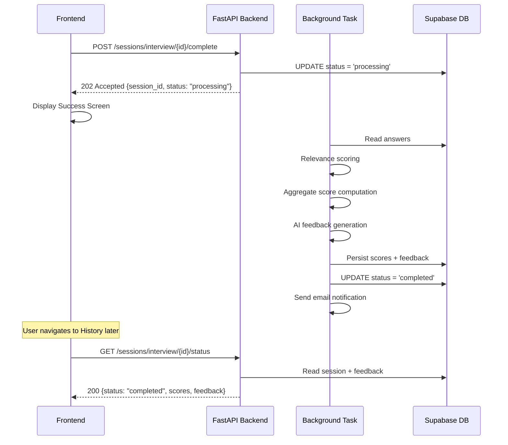
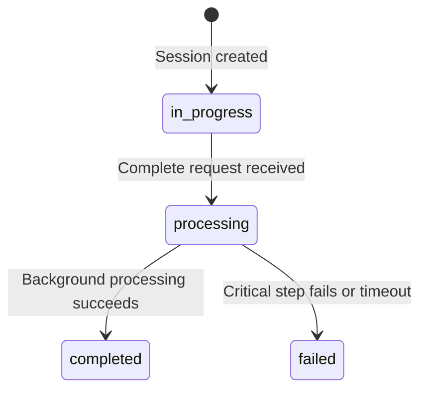

# Design Document: Interview Background Evaluation

## Overview

This feature converts the interview session completion flow from synchronous blocking to asynchronous non-blocking processing. The current implementation keeps the user waiting on a loading spinner while AI scoring, relevance analysis, and feedback generation execute (often 10–30 seconds). The new design mirrors the existing presentation module pattern: the backend returns HTTP 202 immediately, processes results via `asyncio.create_task`, and the frontend shows a success screen with navigation options.

### Key Design Decisions

1. **Reuse the existing presentation async pattern** — `asyncio.create_task` with status tracking, not a job queue. The project already uses this successfully and adding Celery/Redis for one more endpoint is unjustified complexity.
2. **Single status endpoint for both session types** — One `GET /sessions/interview/{session_id}/status` endpoint handles both standard and technical sessions, returning type-appropriate result payloads.
3. **Add `processing` status to the existing `SessionStatus` enum** — The model already has `in_progress`, `completed`, `failed`. Adding `processing` makes the state machine explicit without a schema migration (Supabase uses text columns).
4. **Timeout via `asyncio.wait_for`** — 120-second hard timeout on the background task. If exceeded, the session is marked `failed`.
5. **Partial failure tolerance** — Non-critical steps (relevance scoring, AI feedback, email) are skipped on failure; critical steps (DB persistence, score computation) trigger `failed` status.

## Architecture



### State Machine



## Components and Interfaces

### Backend Components

#### 1. Modified `SessionStatus` Enum (`app/models/session.py`)

Add `PROCESSING = "processing"` to the existing enum.

#### 2. Completion Endpoint (Modified `POST /sessions/interview/{session_id}/complete`)

**Changes to `app/api/routes/interview.py`:**
- Return HTTP 202 instead of 200
- Mark session as `processing` before responding
- Launch background task via `asyncio.create_task`
- Return `{session_id, status}` instead of full report

**New Response Schema:**
```python
class AcceptedSessionResponse(BaseModel):
    session_id: str
    status: str  # "processing"
```

#### 3. New Status Endpoint (`GET /sessions/interview/{session_id}/status`)

**Added to `app/api/routes/interview.py`:**
- Returns current status for any session state
- When `completed`: includes scores and feedback payload
- When `completed` (technical): includes per-answer evaluations and averages
- Validates UUID format, ownership, and existence

**Response Schema:**
```python
class SessionStatusResponse(BaseModel):
    session_id: str
    status: str  # "in_progress" | "processing" | "completed" | "failed"
    scores: Optional[ScoreSummary] = None
    feedback: Optional[FeedbackResponse] = None
    technical_evaluation: Optional[TechnicalEvaluationData] = None
```

#### 4. Background Processor Function (`_run_interview_evaluation_background`)

**Added to `app/api/routes/interview.py`** (matching presentation module pattern):

```python
async def _run_interview_evaluation_background(
    service: SessionService,
    user_id: str,
    session_id: UUID,
    timeout_seconds: int = 120,
) -> None:
```

**Processing Pipeline (standard interview):**
1. Retrieve all answers from DB
2. Execute relevance scoring (non-critical — skip on failure)
3. Compute aggregate scores (critical — fail on error)
4. Persist scores and mark timestamp (critical — fail on error)
5. Generate AI feedback (non-critical — skip on failure)
6. Persist feedback (non-critical — skip on failure)
7. Send email notification (non-critical — skip on failure)
8. Update status to `completed`

**Processing Pipeline (technical interview):**
1. Retrieve all answers from DB
2. Evaluate each answer technically (non-critical per-answer — skip individual failures)
3. Compute aggregate average scores (critical — fail on error)
4. Persist per-answer evaluations and aggregates (critical — fail on error)
5. Generate AI feedback (non-critical — skip on failure)
6. Update status to `completed`

#### 5. Technical Session Completion Endpoint (Modified `POST /sessions/technical/{session_id}/complete`)

**New endpoint added to `app/api/routes/sessions.py`:**
- Same 202 pattern as standard interview
- Launches technical-specific background processor

### Frontend Components

#### 6. New `InterviewSuccessScreen` Component (`features/interview/components/InterviewSuccessScreen.tsx`)

A presentational component showing:
- Success icon (checkmark in green circle)
- Heading: "Session Submitted!"
- Body text: "Your results are being generated. Check the History page for full results."
- Three navigation buttons: "New Session", "View History", "Dashboard"

#### 7. Modified `interviewService.ts`

New functions:
```typescript
export async function completeInterviewSession(sessionId: string): Promise<AcceptedSessionResponse> { ... }

export async function getInterviewStatus(sessionId: string): Promise<SessionStatusResponse> { ... }

export async function completeTechnicalSession(sessionId: string): Promise<AcceptedSessionResponse> { ... }
```

#### 8. Modified `useInterview` Hook

Changes to `completeSession`:
- On 202 response: immediately transition to `"submitted"` phase
- Clear session storage
- No longer wait for report data in the completion flow
- Add error handling with retry capability

New state:
- `phase` gains a new value: `"submitted"`

#### 9. Modified `InterviewSessionPage.tsx`

- When `phase === "submitted"`: render `InterviewSuccessScreen`
- Remove loading spinner for completed state
- Add error state with retry button for failed submissions
- Remove `beforeunload` prevention when in submitted phase

## Data Models

### Session Table (Supabase `sessions`)

No schema change required. The `status` column is a text field. We add the value `"processing"` to the application-level enum only.

| Column | Type | Change |
|--------|------|--------|
| status | text | Now accepts: `in_progress`, `processing`, `completed`, `failed` |

### Session Feedback Table (Supabase `session_feedback`)

No changes. Used as-is to persist AI feedback.

### API Response Models

**`AcceptedSessionResponse`** (new):
```python
{
  "session_id": "uuid-string",
  "status": "processing"
}
```

**`SessionStatusResponse`** (new):
```python
# When status is "completed" (standard interview):
{
  "session_id": "uuid-string",
  "status": "completed",
  "scores": {
    "overall_score": 78,
    "confidence_score": 82,
    "communication_score": 75
  },
  "feedback": {
    "strengths": ["..."],
    "weaknesses": ["..."],
    "recommendations": ["..."]
  }
}

# When status is "completed" (technical interview):
{
  "session_id": "uuid-string",
  "status": "completed",
  "scores": {
    "overall_score": 80,
    "confidence_score": null,
    "communication_score": null
  },
  "technical_evaluation": {
    "evaluations": [
      {
        "question_index": 0,
        "scores": {"technical_accuracy": 85, "completeness": 70, "communication": 90},
        "feedback": "...",
        "weak_areas": ["..."]
      }
    ],
    "average_scores": {"technical_accuracy": 85, "completeness": 70, "communication": 90}
  }
}

# When status is "processing" or "failed":
{
  "session_id": "uuid-string",
  "status": "processing"  // or "failed"
}
```


## Correctness Properties

*A property is a characteristic or behavior that should hold true across all valid executions of a system — essentially, a formal statement about what the system should do. Properties serve as the bridge between human-readable specifications and machine-verifiable correctness guarantees.*

### Property 1: Completion endpoint returns 202 and transitions to processing

*For any* valid session (standard or technical) with status `in_progress`, submitting a completion request SHALL return HTTP 202 with a response body containing the `session_id` and `status` equal to `"processing"`, and the session status in the database SHALL be updated to `"processing"`.

**Validates: Requirements 1.1, 1.2, 1.3, 5.1**

### Property 2: Completion rejects already-processing or completed sessions

*For any* session with status `completed` or `processing`, submitting a completion request SHALL return HTTP 400 and the session status SHALL remain unchanged.

**Validates: Requirements 1.4, 6.4**

### Property 3: Completion returns 404 for non-existent or unauthorized sessions

*For any* session_id that does not exist in the database, or that belongs to a different user than the authenticated requester, submitting a completion request SHALL return HTTP 404.

**Validates: Requirements 1.5**

### Property 4: Successful background processing persists scores and completes

*For any* session with one or more valid answers, when the background processor executes without critical failures, the session status SHALL be `completed` and the database SHALL contain non-null `overall_score`, `confidence_score`, `communication_score`, and feedback data (strengths, weaknesses, recommendations arrays).

**Validates: Requirements 2.2, 2.3**

### Property 5: Critical step failure marks session as failed

*For any* session where the aggregate score computation or database persistence step raises an exception during background processing, the session status SHALL be updated to `failed`.

**Validates: Requirements 2.4**

### Property 6: Non-critical step failure still completes session

*For any* session where relevance scoring, AI feedback generation, or email notification raises an exception during background processing, the session status SHALL still be updated to `completed` (with partial results where available).

**Validates: Requirements 2.5**

### Property 7: Technical evaluation partial failure still completes

*For any* technical session with N answers where K individual answer evaluations fail (0 < K < N), the background processor SHALL persist evaluations for the remaining N-K answers and update the session status to `completed`.

**Validates: Requirements 5.5**

### Property 8: Status endpoint reflects current session status

*For any* session with status `in_progress`, `processing`, or `failed`, the status endpoint SHALL return HTTP 200 with the `status` field matching the current database value.

**Validates: Requirements 3.2, 3.4**

### Property 9: Status endpoint returns full data for completed standard sessions

*For any* completed standard interview session with persisted scores and feedback, the status endpoint SHALL return HTTP 200 with `status` equal to `"completed"`, `scores` containing `overall_score`, `confidence_score`, and `communication_score` (each integer 0–100), and `feedback` containing `strengths`, `weaknesses`, and `recommendations` (each an array of strings).

**Validates: Requirements 3.3**

### Property 10: Status endpoint returns full data for completed technical sessions

*For any* completed technical interview session with persisted evaluations, the status endpoint SHALL return HTTP 200 with `status` equal to `"completed"`, per-answer evaluation scores (`technical_accuracy`, `completeness`, `communication` each 0–100), per-answer `feedback` text, per-answer `weak_areas` list, and aggregate average scores.

**Validates: Requirements 5.2, 5.3**

### Property 11: Invalid UUID returns 422 from status endpoint

*For any* string that is not a valid UUID format, calling the status endpoint SHALL return HTTP 422.

**Validates: Requirements 3.5**

### Property 12: Status endpoint returns 404 for unauthorized sessions

*For any* session_id that does not exist or belongs to a different user, calling the status endpoint SHALL return HTTP 404.

**Validates: Requirements 3.6**

### Property 13: Session storage is cleared on submission

*For any* interview session state in the frontend, when the completion request returns 202 and the UI transitions to the success screen, the persisted session storage SHALL be empty (cleared).

**Validates: Requirements 4.6**

## Error Handling

### Backend Error Handling

| Error Condition | HTTP Status | Behavior |
|----------------|-------------|----------|
| Session not found / not owned by user | 404 | Return error message, no state change |
| Session already `completed` or `processing` | 400 | Return error message, no state change |
| Invalid UUID format (status endpoint) | 422 | FastAPI auto-validation error |
| Background critical failure (score computation, DB write) | N/A (background) | Mark session `failed`, log error |
| Background non-critical failure (relevance, feedback, email) | N/A (background) | Skip step, continue, log warning |
| Background timeout (>120s) | N/A (background) | Mark session `failed`, log error |
| Unauthenticated request | 401 | Handled by existing auth middleware |

### Frontend Error Handling

| Error Condition | UI Behavior |
|----------------|-------------|
| Network error before 202 response | Show error banner with retry button, preserve session state |
| Server 500 on completion request | Show error banner with retry button, preserve session state |
| Server 400 (already processing) | Show informational message, navigate to history |
| Retry button clicked | Re-send completion request, on 202 show success screen |

### Timeout Strategy

The background processor wraps its entire pipeline in `asyncio.wait_for(coro, timeout=120)`. On `asyncio.TimeoutError`, the session is marked `failed`. This prevents zombie sessions that never resolve.

## Testing Strategy

### Property-Based Tests (Backend — Hypothesis)

Property-based testing is appropriate for this feature because:
- The completion endpoint has clear input/output behavior across many possible session states
- The background processor has universal properties about state transitions
- The status endpoint maps session states to response shapes deterministically

**Library:** `hypothesis` (already installed)
**Minimum iterations:** 100 per property test
**Tag format:** `Feature: interview-background-evaluation, Property {N}: {title}`

Tests to implement:
1. **Property 1:** Generate random sessions in `in_progress` state → verify 202 + status transition
2. **Property 2:** Generate sessions in `completed`/`processing` → verify 400 rejection
3. **Property 3:** Generate random UUIDs not in DB → verify 404
4. **Property 4:** Generate sessions with 1–20 answers (mocked AI services) → verify completion persists scores/feedback
5. **Property 5:** Generate sessions, mock DB failure in score persistence → verify `failed` status
6. **Property 6:** Generate sessions, mock relevance/feedback/email failures → verify `completed` status
7. **Property 7:** Generate technical sessions with N answers, fail K evaluations → verify N-K evaluations persisted + completed
8. **Properties 8–10:** Generate sessions in various states with known data → verify status endpoint response shape
9. **Property 11:** Generate random non-UUID strings → verify 422
10. **Property 12:** Generate random UUIDs → verify 404 for non-existent

### Property-Based Tests (Frontend — fast-check)

**Library:** `fast-check` (already installed)
**Minimum iterations:** 100 per property test

Tests to implement:
1. **Property 13:** Generate arbitrary interview state objects → verify storage cleared on submission transition

### Unit Tests (Example-Based)

**Backend (pytest):**
- Happy path: complete standard session → 202 response shape
- Happy path: complete technical session → 202 response shape
- Status endpoint for each state (in_progress, processing, completed, failed)
- Authentication rejection on both endpoints

**Frontend (vitest + testing-library):**
- Success screen renders correct elements (icon, heading, message, 3 buttons)
- Success screen buttons navigate to correct routes
- Error state shows error message and retry button
- Retry button re-sends request
- No confirmation dialog on navigation from success screen

### Integration Tests

- End-to-end: submit completion → poll status → verify completed (with mocked AI services)
- Timeout scenario: slow mock → verify session marked failed after 120s
- Concurrent completion attempts: two requests for same session → one 202, one 400
